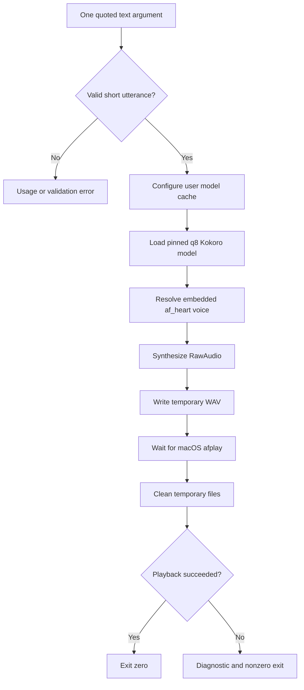
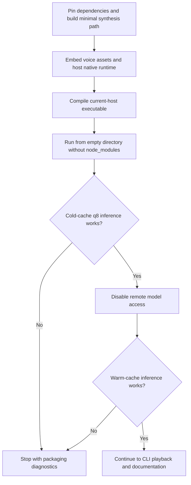

# Kokoro TTS CLI - Plan

## Goal Capsule

- **Objective:** Build a macOS-first Bun and TypeScript CLI that speaks one quoted text argument with Kokoro's `af_heart` voice and q8 model.
- **Authority:** The Product Contract owns user-visible behavior. The Planning Contract owns implementation mechanisms. Implementation Units cannot weaken either contract.
- **Execution profile:** Implement the smallest source-mode path needed for synthesis, then prove the standalone executable before adding CLI polish.
- **Stop condition:** If a host-architecture executable cannot synthesize from an otherwise empty directory without project `node_modules` or persistent native sidecars, stop with the failing artifact and diagnostics. Do not silently switch to sidecars, WASM, a browser runtime, or embedded model weights.
- **Tail ownership:** U4 owns final documentation and end-to-end verification. Completion includes removing abandoned packaging experiments from the branch.

---

## Product Contract

### Summary

The plan delivers a single-argument speech command for Bun source mode and a standalone macOS executable. Kokoro code and every voice profile ship in the executable, while the q8 model downloads once into the user's cache and is reused by later runs.

### Problem Frame

The current repository is an untouched `bun init` scaffold. The desired source invocation is simple, but standalone packaging crosses three runtime boundaries: Kokoro dynamically reads voice files, Transformers.js downloads model artifacts to a filesystem cache, and ONNX Runtime loads a platform-specific native addon plus a companion dynamic library.

Source-mode success does not establish that the executable is self-contained. The implementation must prove asset discovery and native inference with project dependencies unavailable before treating the CLI as shippable.

### Requirements

**Input and speech behavior**

- R1. The CLI accepts exactly one positional argument containing non-whitespace text and rejects missing, blank, or additional arguments before loading the model.
- R2. V1 accepts short utterances up to 200 Unicode code points and rejects longer text instead of allowing Kokoro to truncate it silently.
- R3. Every valid invocation uses `onnx-community/Kokoro-82M-v1.0-ONNX`, `dtype: "q8"`, `device: "cpu"`, and voice `af_heart` with no user-selectable alternatives.
- R4. A successful invocation returns only after `/usr/bin/afplay` finishes playing the generated speech through the macOS default audio output.

**Packaging and caching**

- R5. The compiled artifact embeds the Kokoro JavaScript dependency and all 54 `.bin` voice files shipped by the pinned `kokoro-js` package, including profiles not exposed by its current public voice table.
- R6. The compiled artifact runs from an otherwise empty directory without project `node_modules` or persistent native sidecars; the model cache is its only external runtime data dependency.
- R7. Missing model artifacts download into `~/Library/Caches/kokoro-cli/transformers`, and later invocations reuse that cache without downloading the same artifacts again.
- R8. V1 supports only the current macOS host architecture. Cross-compilation, universal binaries, and other operating systems are not part of this plan.

**Failure and cleanup behavior**

- R9. Usage, download, synthesis, cache, and playback failures produce concise diagnostics on stderr and a nonzero exit without printing a stack trace during normal CLI use.
- R10. Temporary audio and any ephemeral native-runtime materialization are removed after success or failure once the consuming process has finished with them.
- R11. First-run model loading reports concise activity on stderr so the q8 download does not appear to hang.

### Key Flow

- F1. Speak one utterance
  - **Trigger:** The user runs the source entry point or compiled executable with one quoted text argument.
  - **Steps:** Validate input, prepare the writable cache, load the fixed q8 model, synthesize with `af_heart`, write a temporary WAV, play it with `afplay`, and clean up.
  - **Outcome:** Speech finishes and the process exits successfully, or the process exits nonzero with cleanup complete.
  - **Covered by:** R1-R4, R7, R9-R11

### Acceptance Examples

- AE1. Cold source-mode run
  - **Covers:** F1, R1-R4, R7, R11
  - **Given:** The model cache is empty and the machine can reach Hugging Face.
  - **When:** The user runs `bun index.ts "How was your day?"`.
  - **Then:** The CLI downloads the q8 artifacts into the user cache, speaks with `af_heart`, and exits after playback.
- AE2. Warm offline run
  - **Covers:** F1, R7
  - **Given:** A previous successful run populated the model cache and remote model access is unavailable.
  - **When:** The user speaks another valid utterance.
  - **Then:** Synthesis and playback succeed without changing or redownloading cached model artifacts.
- AE3. Isolated executable run
  - **Covers:** R5-R8
  - **Given:** The executable is copied to an empty directory, project `node_modules` is unavailable, and the executable matches the current host architecture.
  - **When:** The executable speaks a valid utterance with an empty cache and then repeats with a warm cache and remote access disabled.
  - **Then:** Both runs succeed, all voice assets remain available, and no persistent native sidecars are created.
- AE4. Invalid arguments
  - **Covers:** R1, R2, R9
  - **Given:** The model is not loaded.
  - **When:** The user supplies no argument, whitespace, multiple arguments, or more than 200 Unicode code points.
  - **Then:** The CLI writes usage or validation guidance to stderr and exits nonzero without downloading or synthesizing.
- AE5. Playback failure
  - **Covers:** R4, R9, R10
  - **Given:** Synthesis succeeds but `afplay` exits nonzero.
  - **When:** The CLI waits for playback.
  - **Then:** The CLI reports the playback failure, exits nonzero, and removes the temporary directory.

### Scope Boundaries

**In scope**

- Direct execution through `bun index.ts` and a Bun-compiled executable.
- One fixed voice, model, quantization, speed, and CPU execution provider.
- Current-host macOS playback and packaging.
- A clean-room standalone feasibility gate with a hard stop on failure.

#### Deferred to Follow-Up Work

- Voice, speed, model, output-path, or cache-path flags.
- stdin, interactive prompts, piped input, and unquoted multi-argument joining.
- Long-form chunking, streaming, and WAV concatenation.
- Saved-audio mode and formats other than temporary WAV playback.
- Intel/Apple Silicon cross-builds, universal binaries, Linux, and Windows.
- Immutable Hugging Face revisions, checksum manifests, and automatic cache repair.
- Transformers.js v4 migration or an ONNX Web/WASM backend.

**Outside this product's identity**

- A browser UI, local web server, or hosted speech API.

---

## Planning Contract

### Key Technical Decisions

- KTD1. **Embed voices and cache model weights.** (session-settled: user-directed — chosen over embedding the q8 model weights: the executable should include Kokoro and its voices while keeping the large model in a reusable first-run cache.) Governs R5-R7.
- KTD2. **Use Bun as the only project runtime and toolchain.** (session-settled: user-directed — chosen over a browser or Node-specific application: the CLI already uses Bun for TypeScript execution and native compilation.) Follow `CLAUDE.md` for install, build, test, subprocess, and file APIs. Governs R1-R11.
- KTD3. **Pin the researched dependency line.** Pin `kokoro-js` to `1.2.1` and `@huggingface/transformers` to `3.5.1`, retain `onnxruntime-node` `1.21.0` through the lockfile, and defer the incompatible major-version survey. Exact pins keep the private asset adapters tied to one reviewed package layout.
- KTD4. **Make standalone inference a release gate.** The first compiled proof must load the host native addon and companion dylib, read embedded `af_heart`, open the q8 model, and synthesize with project `node_modules` unavailable. Failure triggers the Goal Capsule stop condition rather than a fallback architecture.
- KTD5. **Use a pinned dependency patch for voice injection.** Add the smallest `bun patch` needed for Kokoro's private voice loader to accept an embedded voice-byte provider while preserving its packaged-filesystem behavior in source mode. Do not vendor the entire library or depend on the neighboring checkout.
- KTD6. **Treat native runtime extraction as ephemeral executable internals.** If Bun cannot colocate the ONNX addon and dylib automatically, a pinned runtime adapter may materialize both from embedded bytes into one unique temporary directory before dynamically importing Kokoro. It must clean the directory after inference and must not install persistent sidecars.
- KTD7. **Use the macOS cache convention.** Set Kokoro's exported `env.cacheDir` before model construction to the absolute `~/Library/Caches/kokoro-cli/transformers` path. The cache remains disposable and user-removable.
- KTD8. **Keep parsing and playback dependency-free.** Validate the single positional argument with a small pure function. Save synthesized audio into a collision-safe temporary directory, spawn `/usr/bin/afplay` with an argument array, await its exit, and clean up in `finally`.
- KTD9. **Keep automated tests offline by default.** Unit tests use injected synthesis, filesystem, and subprocess seams. Network/model and standalone-binary tests run as explicit integration gates.

### High-Level Technical Design

**Runtime data flow**

**Standalone feasibility gate**

### Sequencing

U1 establishes the smallest source-mode synthesis core and cache behavior. U2 consumes that core to prove the executable in isolation and is a hard gate for U3 and U4. U3 adds user-facing argument handling and macOS playback only after packaging passes. U4 documents and verifies the finished contract.

### Risks and Dependencies

- **Native ONNX loading:** Transformers.js detects Bun as Node and `onnxruntime-node` selects its addon through a computed path. The macOS addon also requires `libonnxruntime.1.21.0.dylib` beside it. KTD4 and U2 contain this risk before CLI polish.
- **Bun documentation drift:** Current online documentation describes directory asset support that is absent from the local Bun 1.3.14 API surface. U2 must target the installed version's static file imports or extra asset entrypoints and verify the generated layout instead of assuming newer `compile.assets` behavior.
- **Kokoro private loader:** `kokoro-js` resolves `../voices/<id>.bin` dynamically and does not export a Node voice-path override. KTD5 keeps the adaptation version-pinned and narrow.
- **Mutable model source:** Kokoro's wrapper does not expose a Hugging Face revision, and Transformers.js 3.5.1 reuses URL-keyed cached files without checksum revalidation. V1 documents cache deletion as corruption recovery rather than adding a custom downloader.
- **Playback format:** `RawAudio.save()` produces a float WAV. U3 must smoke-test that the host `/usr/bin/afplay` accepts the generated file before declaring playback complete.

### Sources and Research

- Bun standalone executable assets and Node-API guidance: [Bun executable documentation](https://bun.com/docs/bundler/executables) and [Bun Node-API documentation](https://bun.com/docs/runtime/node-api).
- Transformers.js model-cache behavior: [server-side inference in Node.js](https://huggingface.co/docs/transformers.js/main/tutorials/node#model-caching).
- macOS cache placement: [Apple File System Programming Guide](https://developer.apple.com/library/archive/documentation/FileManagement/Conceptual/FileSystemProgrammingGuide/MacOSXDirectories/MacOSXDirectories.html).
- Kokoro package behavior: [Kokoro 1.2.1 voice loader](https://github.com/hexgrad/kokoro/blob/v1.2.1/src/voices.js), [runtime wrapper](https://github.com/hexgrad/kokoro/blob/v1.2.1/src/kokoro.js), and [package manifest](https://github.com/hexgrad/kokoro/blob/v1.2.1/package.json).
- Model artifact size and quantizations: [Kokoro ONNX model files](https://huggingface.co/onnx-community/Kokoro-82M-v1.0-ONNX/tree/main/onnx).
- Native-runtime packaging risk: [Transformers.js issue 1164](https://github.com/huggingface/transformers.js/issues/1164) and [issue 1406](https://github.com/huggingface/transformers.js/issues/1406).

---

## Implementation Units

### U1. Establish pinned synthesis and cache core

- **Goal:** Produce one q8 `af_heart` utterance in source mode through a small testable service with an explicit macOS cache path.
- **Requirements:** R3, R7, R9, R11
- **Dependencies:** None
- **Files:** `package.json`, `bun.lock`, `src/cache.ts`, `src/tts.ts`, `src/cache.test.ts`, `src/tts.test.ts`, `tests/model-cache.integration.test.ts`
- **Approach:**
  1. Add exact runtime dependency versions and Bun scripts without introducing a CLI framework.
  2. Derive and create the absolute macOS cache directory before constructing the model.
  3. Encapsulate fixed model, dtype, device, and voice settings behind a synthesis seam that accepts progress and error reporting.
  4. Keep the network-dependent cold/warm cache proof outside the default unit-test suite.
- **Execution note:** Build the smallest real synthesis path needed by U2. Do not add playback or option parsing yet.
- **Patterns to follow:** Bun-only commands and APIs from `CLAUDE.md`; Kokoro usage from the pinned package README.
- **Test scenarios:**
  1. A mocked synthesis request always selects the q8 CPU model and `af_heart`.
  2. Cache derivation for a known home directory returns the expected absolute `Library/Caches/kokoro-cli/transformers` path.
  3. A model-load failure returns an actionable error that names the cache location without leaking a raw stack trace.
  4. Covers AE1. An opt-in integration run with an empty cache downloads model artifacts beneath the configured root and produces non-empty audio.
  5. Covers AE2. The integration run repeats with remote access disabled and reuses the warmed cache successfully.
- **Verification:** Offline unit tests pass. The opt-in integration gate proves cold download and warm offline reuse with the pinned q8 model.

### U2. Prove embedded voices and standalone native inference

- **Goal:** Produce a current-host macOS executable that passes the clean-room synthesis contract before user-facing CLI work continues.
- **Requirements:** R5, R6, R8, R10
- **Dependencies:** U1
- **Files:** `build.ts`, `package.json`, `bun.lock`, `.gitignore`, `src/embedded-voices.ts`, `src/embedded-voices.test.ts`, `scripts/verify-standalone.ts`, `tests/standalone.integration.test.ts`, `patches/kokoro-js@1.2.1.patch`; conditional only if Bun's default native extraction fails: `src/native-runtime.ts`, `patches/onnxruntime-node@1.21.0.patch`
- **Approach:**
  1. Expand the pinned package's voice directory at build time, assert the expected manifest and `af_heart.bin`, and embed each binary through a Bun 1.3.14-supported asset path with stable basenames.
  2. Patch Kokoro's private loader only enough to resolve voice bytes from the executable while retaining source-mode filesystem reads.
  3. Statically account for the host ONNX addon and companion dylib. Use an ephemeral colocated materialization adapter only if Bun's default extraction is insufficient.
  4. Compile the executable and run it outside the repository with project `node_modules` unavailable.
  5. Exercise empty-cache online inference followed by warm-cache offline inference. Apply the Goal Capsule stop condition if either run fails.
- **Execution note:** Treat this unit as a feasibility gate. Remove any abandoned patch or extraction approach before proceeding.
- **Patterns to follow:** Bun executable asset and Node-API documentation; the pinned Kokoro and ONNX package layouts captured under Sources and Research.
- **Test scenarios:**
  1. The build fails before compilation if the pinned package does not contain exactly the expected 54 voice files or lacks `af_heart.bin`.
  2. The embedded registry exposes every shipped voice basename and resolves `af_heart` to the original bytes.
  3. Source mode continues reading package voice files without depending on executable-only globals.
  4. Covers AE3. The compiled binary runs from a clean temporary directory with project `node_modules` unavailable, downloads q8 into an empty cache, and synthesizes non-empty audio.
  5. Covers AE3. The same isolated binary repeats with remote model access disabled and a warm cache.
  6. The isolated run leaves no native addon, dylib, or voice sidecar after process cleanup.
- **Verification:** The compiled executable passes the clean-room cold/warm inference gate on the current macOS host architecture. Failure stops implementation rather than activating a fallback.

### U3. Add positional CLI behavior and macOS playback

- **Goal:** Turn the proven synthesis path into the requested one-command speaking experience.
- **Requirements:** R1-R4, R9-R11; F1
- **Dependencies:** U2
- **Files:** `index.ts`, `src/cli.ts`, `src/playback.ts`, `src/cli.test.ts`, `src/playback.test.ts`, `tests/cli.integration.test.ts`
- **Approach:**
  1. Keep `index.ts` as a guarded entry point and separate pure argument validation from orchestration.
  2. Reject invalid or oversized input before cache creation or model loading.
  3. Write synthesized audio to a unique temporary directory and call `/usr/bin/afplay` through an argument array.
  4. Await playback, convert nonzero process status into a CLI failure, and clean the temporary directory in `finally`.
  5. Keep stdout free for future machine-readable use and send status, usage, and diagnostics to stderr.
- **Execution note:** Write argument and cleanup behavior against injected seams before wiring the real model and subprocess.
- **Patterns to follow:** Bun `import.meta.main`, `Bun.spawn`, and Bun test APIs from `CLAUDE.md` and upstream documentation.
- **Test scenarios:**
  1. Covers AE4. Zero arguments return usage failure without calling cache or synthesis dependencies.
  2. Covers AE4. Whitespace-only input returns validation failure without loading the model.
  3. Covers AE4. Two positional arguments return usage failure and do not silently join the text.
  4. Covers AE4. An input of 201 Unicode code points returns a length failure before synthesis.
  5. A valid quoted input passes its exact text to the synthesizer and always requests `af_heart`.
  6. Playback waits for `afplay` to exit before removing the WAV and returning success.
  7. Covers AE5. A nonzero `afplay` exit reports failure and removes the temporary directory.
  8. A synthesis exception also removes any temporary directory created by the invocation.
  9. Covers AE1. With an empty cache, the source entry point emits concise model-loading activity on stderr, speaks a valid short utterance through the real q8 model, and exits after audio completes.
- **Verification:** Offline unit and integration tests prove orchestration and cleanup. A real source-mode smoke test produces audible speech on the host Mac.

### U4. Document and verify the distributable CLI

- **Goal:** Make first-run cost, platform limits, cache recovery, build output, and manual verification discoverable.
- **Requirements:** R1-R11; AE1-AE5
- **Dependencies:** U3
- **Files:** `README.md`, `package.json`, `.gitignore`
- **Approach:**
  1. Document source and executable invocation, exact quoting behavior, the 200-code-point limit, fixed voice/model choices, and macOS-only support.
  2. Document the approximately 92.4 MB first-run q8 download, cache location, warm offline reuse, and delete-cache recovery for corrupt artifacts.
  3. Expose focused Bun scripts for type checking, offline tests, build, model-cache integration, and clean-room standalone verification.
  4. Run the complete verification contract and record any unavoidable host-specific manual gap in the pull request rather than weakening the checks.
- **Test expectation:** None -- this unit documents and exposes behavior already proved by U1-U3.
- **Verification:** A new user can follow the README from install through source speech and compiled speech. Generated artifacts stay out of version control.

---

## Verification Contract

| Gate | Command | Proves | Applies to |
|---|---|---|---|
| Type safety | `bun run typecheck` | Strict TypeScript compilation succeeds without emit | U1-U4 |
| Offline automated tests | `bun test` | Argument, cache, voice registry, orchestration, playback, and cleanup contracts | U1-U3 |
| Model cache integration | `bun run smoke:model-cache` | Empty-cache q8 download and warm-cache offline reuse | U1, U4 |
| Executable build | `bun run build` | Current-host binary and embedded asset manifest are produced | U2, U4 |
| Standalone isolation | `bun run smoke:standalone` | Binary runs with `node_modules` unavailable, cold then warm cache, and no persistent sidecars | U2, U4 |
| Source speech | `bun index.ts "How was your day?"` | A cold-cache run reports model-loading activity on stderr and produces audible q8 speech with `af_heart` | U3, U4 |
| Compiled speech | `dist/kokoro-cli "How was your day?"` | Audible standalone playback on the current host Mac | U3, U4 |

The network/model and audible playback gates are explicit integration checks. They must not run as part of the default offline `bun test` suite.

---

## Definition of Done

- R1-R11 are implemented and traced through the passing unit and integration gates.
- U1's cold-cache and warm-offline model tests pass with the pinned q8 model.
- U2's isolated executable passes on the current host architecture with all 54 voice profiles embedded and no project dependencies or persistent native sidecars.
- U3 speaks the exact valid argument with `af_heart`, waits for playback, and cleans temporary artifacts on every tested exit path.
- U4 documents first-run download size, cache location and recovery, macOS/architecture limits, source invocation, and executable invocation.
- Dependency pins and any package patches are committed with `bun.lock` and are limited to the verified integration seams.
- Abandoned packaging experiments, unused adapters, temporary artifacts, and generated `dist/` output are absent from the committed diff.
- All Verification Contract gates that apply to the host pass. Any gate blocked by unavailable external state is reported as a blocker rather than marked complete.
