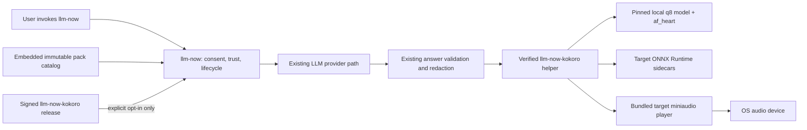
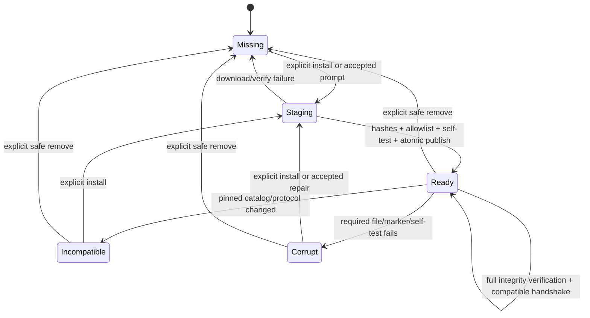
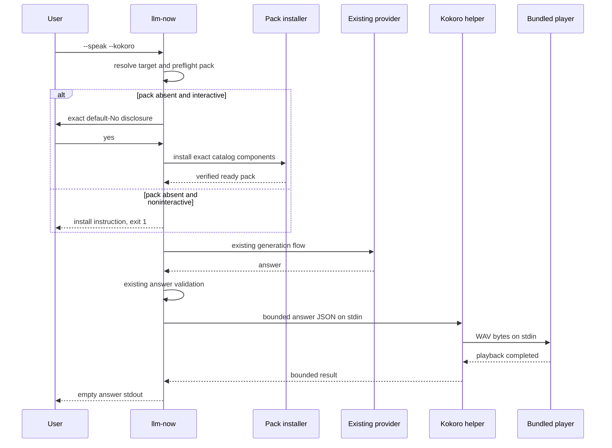

# Optional Cross-Platform Kokoro Speech Pack - Plan

## Goal Capsule

- **Objective:** Add an opt-in Kokoro speech engine to `llm-now` that speaks with the q8 `af_heart` voice through native ONNX Runtime on macOS, Linux, and Windows without increasing every normal `llm-now` install by the size of the runtime and model.
- **Repository boundary:** Create `swartzrock/llm-now-kokoro` from the existing local `kokoro-cli` Git history. That repository builds and releases the optional speech pack; `llm-now` remains the only user-facing CLI and owns consent, downloading, verification, installation, removal, and subprocess policy.
- **Authority:** The Product Contract owns observable CLI, opt-in, privacy, compatibility, and speech behavior. The Planning Contract owns the two-repository protocol, pack layout, trust chain, installer transaction, platform release matrix, tests, documentation, and pull-request sequence. Repository instructions and tests remain binding where this plan is silent.
- **Execution profile:** Four implementation phases and four pull requests. The first two are stacked in `llm-now-kokoro`; the final two are stacked in `llm-now`. A signed immutable release candidate feeds the consumer work; the stable helper release is published and the final catalog regenerated only after cross-repository compatibility passes.
- **Stop conditions:** Stop before publishing or consuming a pack if licensing obligations are unresolved; any target lacks a verified native file set and bundled playback path; macOS payload notarization or Windows payload signing is unavailable; a pack cannot install without running downloaded unverified code; the helper can fetch remote resources during speech; or `llm-now` cannot guarantee zero speech-pack network activity before explicit opt-in.
- **Tail ownership:** Each phase is implemented, tested, committed, pushed, and opened as a pull request before the next phase begins. Release `llm-now-kokoro` first; release the pinning `llm-now` version only after the exact pack artifacts are immutable and verified.

---

## Product Contract

### Summary

`llm-now` gains an optional Kokoro speech mode selected by composing the existing `--speak` flag with a new `--kokoro` modifier. Plain `--speak` keeps the current macOS system-speech behavior. `--speak --kokoro` always uses native CPU inference with the q8 Kokoro model, the `af_heart` voice, and speed `1.0` on all five supported `llm-now` release targets.

The normal `llm-now` archive does not embed Kokoro, ONNX Runtime, model weights, voices, or a native audio player. On first interactive use, `llm-now` shows a default-No disclosure with the exact download size, installed size, source, version, destination, included components, licenses, and removal command. An accepted prompt or explicit maintenance command installs a pinned, verified speech pack. Noninteractive speech never prompts or downloads.

The separate `llm-now-kokoro` repository is an implementation and release boundary, not a second product. Its helper is installed to a private versioned application-data directory, is never added to `PATH`, has no download fallback, accepts only bounded validated answer text over stdin, and owns synthesis plus cross-platform playback.

### Problem Frame

`llm-now` already has a strong macOS `/usr/bin/say` process boundary, but the built-in voice is unavailable on Linux and Windows and differs between machines. Directly importing Kokoro and `onnxruntime-node` into `llm-now` would make every release much larger, couple the main binary to native-library loading, and add model, voice, signing, and licensing concerns to every installation even when speech is unused.

The existing `kokoro-cli` prototype proves native ONNX and WASM inference locally, but it is not yet a distributable cross-platform speech pack. It currently builds only for Apple silicon macOS, embeds all voices and both backends, passes text as an argument, uses macOS-only cache and playback paths, and extracts native runtime files on each invocation. The implementation must narrow and harden that prototype before `llm-now` depends on it.

### Requirements

#### Repository and release boundary

- R1. `swartzrock/llm-now-kokoro` is created from the existing local `kokoro-cli` Git history rather than as a blank repository; it has its own versioning, license, third-party notices, security/release documentation, CI, and immutable release artifacts. Before any public remote is populated, every commit, tag, LFS object, and large binary passes a secret, provenance, license, and repository-size audit; a failed audit requires a documented history rewrite or a non-public repository rather than publishing the history unchanged.
- R2. `llm-now-kokoro` is not a user-facing installation target: its executable is not put on `PATH`, its flags are an internal versioned protocol, and all user documentation calls the downloaded unit the optional “Kokoro speech pack.”
- R3. A complete pack release contains one fixed runtime file set for each supported target—macOS x64 baseline, macOS arm64, Linux x64 baseline glibc, Linux arm64 glibc, and Windows x64 baseline—and one shared target-independent asset file set. Files are individually downloadable release assets; no installable archive is part of the protocol.
- R4. Each runtime set contains only the matching helper, ONNX addon/runtime libraries, pinned phonemizer resources, bundled audio player, and required notices. The shared set contains only the pinned q8 model files, `af_heart`, and required notices. No ONNX inference WASM runtime, CUDA provider, unrelated platform runtime, or other voice is shipped. The pinned eSpeak phonemizer's embedded WASM module is permitted, manifest-listed, hashed, and license-audited; it is text preprocessing, not an inference fallback.
- R5. `llm-now` pins one exact pack catalog per target: immutable per-file URLs, logical destination paths, exact download and installed byte counts, SHA-256 digests, expected modes, protocol version, required capabilities, upstream dependency versions, and model revision. It never accepts a server-provided filename or resolves “latest” at runtime.
- R6. Publication is blocked until licensing and redistribution obligations for Kokoro, Transformers.js, ONNX Runtime, the model/training-data attribution, eSpeak NG/phonemizer, Bun/JavaScriptCore, miniaudio, and any Windows app-local runtime files are documented and satisfied. The helper repository uses GPL-3.0-or-later unless a documented review establishes a different compliant license; it is never published under a permissive-only license while GPL-covered eSpeak code/data remain in the payload.
- R7. Downloaded native code has its own platform trust posture: the macOS helper, addon, dynamic libraries, and player are signed inside-out and notarized together through a build-only submission bundle; Windows executables and DLLs are Authenticode-signed and timestamped; Linux files are checksum-pinned and attested. Catalog generation verifies the exact release bytes with macOS signature/notarization checks or Windows `WinVerifyTrust` before their hashes can enter `llm-now`. At install and before every execution, the SHA-256 values embedded in the already distributed `llm-now` binary are the enforcement gate; the design does not assume a programmatic downloader sets quarantine or Mark-of-the-Web metadata. The real download/launch path is tested on stock supported systems. GitHub attestations supplement, but do not replace, that trust chain. The plan does not claim stapling for individually distributed macOS files.

#### Helper runtime and protocol

- R8. The helper uses pinned native `onnxruntime-node` CPU inference only, local q8 model files only, fixed `af_heart`, fixed speed `1.0`, and no remote-model fallback. It neither downloads nor updates any component.
- R9. The helper and ONNX native sidecars run from ordinary filesystem paths within the verified installation. No native addon or dynamic library is loaded from Bun’s embedded filesystem or extracted to a fresh temporary directory on every invocation.
- R10. The helper exposes a small versioned protocol for information, self-test, and speech. `llm-now` requires the exact protocol major and named capabilities and fails closed on malformed, oversized, missing, older, or newer-major responses.
- R11. Speech accepts one bounded UTF-8 JSON request over stdin containing the already validated answer text; answer text is never sent in argv, filenames, environment variables, diagnostics, or the protocol-info response. Trusted protocol and asset-path controls may use fixed argv fields.
- R12. The helper owns playback on all targets through an exact bundled player path, with no reliance on `afplay`, `aplay`, `paplay`, PowerShell, shell lookup, or a program found on `PATH`. Generated audio is streamed to the player rather than persisted as an answer-bearing temporary file.
- R13. The helper and player honor cancellation, the existing 120-second overall speech timeout, model-aware input and audio bounds, stage deadlines, output bounds, and cleanup; success, failure, and cancellation have stable exit behavior. Raw native diagnostics are bounded and converted by `llm-now` into value-free user-facing errors. The helper creates no crash dumps or custom dump handlers, disables core dumps where the platform permits, clears answer buffers after use, and documents unavoidable OS-managed crash-report behavior.

#### Opt-in lifecycle and persistence

- R14. Speech-pack files live in durable per-user application data, not an OS-purgeable cache: macOS Application Support, Linux XDG data, and Windows LocalAppData. One centralized resolver supports an `LLM_NOW_DATA_DIR` override for hermetic tests, portable installations, and no-exec home-directory remediation.
- R15. V1 uses one immutable `packVersion` as its only installation lifecycle version. A pack manifest binds the target runtime files, model/voice assets, protocol major, modes, sizes, and hashes under one exact version path with same-filesystem staging. A pack becomes ready only after every component is verified, a helper self-test passes, and a trusted completion marker is written last; no `current` link or independently versioned runtime/asset lifecycle exists.
- R16. `--kokoro-install` is explicit download authorization and works in interactive or noninteractive environments without a second confirmation. Before downloading it prints the exact disclosure and progress to stderr. Progress uses named download, verification, and self-test stages; TTY output may update one plain-text line, while non-TTY output emits bounded non-ANSI milestones. Ctrl-C at any stage cleans only owned staging, preserves the prior pack, prints one value-free cancellation line, and exits `130`; retry starts the interrupted file again. The only other network-enabled path is an interactive first-use prompt after an affirmative answer.
- R17. `--kokoro-status`, `--kokoro-verify`, `--kokoro-remove`, normal speech, declined first-use consent, unsupported targets, and missing-pack noninteractive speech make zero speech-pack network requests. The chosen LLM provider may still use the network; documentation distinguishes that from offline speech.
- R18. Installation maps each catalog item to a fixed local path, streams it into a uniquely created no-follow partial file, restricts redirects to catalog-approved HTTPS hosts, rejects credentialed, downgrade, loopback, private, link-local, and cross-host destinations, enforces size and time limits, and verifies expected bytes and SHA-256 before same-filesystem publication. It never derives a path from a response header and does not support partial-download resume in v1.
- R19. Concurrent installers, interruption, disk-full, corrupt downloads, per-file publication failure, or self-test failure cannot expose a partial pack as ready or destroy a prior working version. A losing concurrent installer verifies the winner and removes only its own staging data.
- R20. `--kokoro-status` prints exactly one of `missing`, `ready`, `corrupt`, or `incompatible` to stdout and exits `0` for every valid observed state; optional human details include installed pack count and total bytes on stderr. `--kokoro-verify` prints `ready` and exits `0`, or prints a value-free remediation and exits `1`. Successful install prints `ready`; successful/no-op remove prints `removed`; cancellation exits `130`; operational or partial-removal failure exits `1`. Re-running `--kokoro-install` is the explicit install, repair, or upgrade action. `--kokoro-remove` removes every recognized managed pack directory, never follows links, preserves ambiguous unknown content, and leaves a consistent installation if Windows reports files in use.
- R21. An upgrade installs side-by-side, preserves every prior working pack, and selects the exact new version path rather than a symlink. V1 never automatically deletes a prior version because an older `llm-now` binary or rollback may still pin it; explicit `--kokoro-remove` is the cleanup boundary.

#### `llm-now` speech behavior

- R22. Plain `--speak` remains the existing macOS system engine and remains unsupported on Linux and Windows. `--kokoro` is a modifier that requires `--speak`; `--stream --speak` remains invalid; `--voice-route --speak --kokoro` remains supported.
- R23. Kokoro pack availability is preflighted immediately after parsing and target resolution, before reading stdin, opening the launcher, resolving aliases, discovering providers, accessing credentials, or making provider calls. First-use consent reuses `isInteractive(stdin, stderr)` from `src/io.ts`: both streams must be TTYs, stdout is irrelevant, and the prompt reads only that TTY stdin and renders only to stderr. Piped stdin is therefore always noninteractive and can never be consumed by consent. An unsupported, declined, missing, corrupt, or incompatible pack fails before those boundaries.
- R24. When a pack is missing, corrupt, or incompatible on interactive use, the default-No prompt uses a state-specific headline/action—install, repair, or install compatible version—and discloses the actual incremental download, resulting installed and retained-pack bytes, source release, install location, included components, license link/summary, and removal command. It states that existing versions remain and gives the exact `--kokoro-install` command after decline. Yes installs and continues the original invocation; No exits `1`; Ctrl-C exits `130`.
- R25. Missing, corrupt, or incompatible Kokoro in noninteractive speech exits `1` with one actionable `--kokoro-install` instruction, without reading stdin, prompting, touching provider state, or downloading. Pack-level failures remain stderr-only because a trusted speech engine is unavailable.
- R26. Kokoro mode preserves the existing speech-oriented generation prompt, voice-routing behavior, final-answer validation, credential screening, timeout/cancellation semantics, spoken stable failure notices after the engine is ready, and answer-empty stdout on successful speech.
- R27. Only the final validated answer or stable built-in notice crosses the helper boundary as user- or provider-derived text; fixed trusted protocol and asset-path controls may cross as specified by R11. Provider credentials, aliases, original prompts, instructions, configuration, and inherited loader/runtime injection variables never cross it.
- R28. Existing `voice`, `rate`, and `pitch` configuration keeps its system-voice meaning and is ignored, without reinterpretation or warning, in Kokoro v1. No persistent speech-engine setting or Kokoro voice/speed/pitch setting is added in v1.

#### Size, compatibility, and operability

- R29. Adding the opt-in feature increases each compressed normal `llm-now` release archive by no more than 1 MiB. The first target-specific pack may download at most 250 MiB and occupy at most 300 MiB; exceeding either budget requires an explicit plan revision rather than merely publishing the measurement. Exact before/after archive, download, installed, retained-version, and aggregate speech-pack sizes are recorded in the integration pull request and first-use disclosure.
- R30. Release validation assembles the catalog file set into an arbitrary clean install root on representative machines with no Bun, Node, `node_modules`, or system audio command dependency. It covers paths with spaces, non-ASCII text, x64 baseline CPUs, macOS 13+, Linux x64 glibc 2.27+, Linux arm64 glibc 2.17+ on the exact Bun-supported kernel/CPU floor recorded by the release, and a clean supported Windows VM with all required runtime DLLs provided or verified.
- R31. Warm installed speech is measured separately from first installation and helper self-test. Each target records integrity preflight, process startup, model load, synthesis, playback latency, failure rate, and peak memory for the same fixed phrase set. Stable release requires: no clipping, truncation, repeated/missing words, or wrong voice; 100 successful runs per target with no crash/hang; peak helper-plus-player RSS below 1 GiB; time to first audio at or below 5 seconds for the fixed short phrase; and near-limit synthesis real-time factor at or below 1.0 on the recorded reference host. A blinded comparison by at least three listeners must rate `af_heart` no worse in median naturalness than the current macOS default enhanced English voice. Missing a gate blocks that target and reopens q8, one-shot loading, or target support; v1 emits no waiting indicator because the time-to-audio ceiling is the release contract.
- R32. Before every info, self-test, or speech execution, `llm-now` verifies the catalog digest of the helper, player, native addon, dynamic libraries, model, voice, tokenizer/config, and protocol fixtures; resolves an absolute root whose components are owned by the current user, non-link/non-reparse, and not writable by other principals; and returns an opaque verified-pack capability accepted by the subprocess client. The same checks apply to an absolute `LLM_NOW_DATA_DIR` override. A parent verification failure starts no helper and crosses no input/provider boundary. After a verified helper starts for speech, it rechecks the bound asset manifest before reading text; a race detected there accepts no answer text and returns a bounded value-free failure.
- R33. One versioned canonical contract artifact defines operation selection, JSON schemas, a maximum of 500 Unicode scalar values and 509 non-special phoneme tokens, `16 KiB` stdout and stderr limits, exit codes (`0` success, `1` operation failure, `2` protocol/usage failure, `130` cancellation), capability semantics, and silent self-test behavior. The helper rejects oversized or expansion-heavy text before ONNX inference or player startup, never silently token-truncates, limits generated audio to 1,800,000 samples (75 seconds at 24 kHz), and enforces 10-second phonemization and 30-second inference stage deadlines inside the 120-second overall timeout. Self-test hashes and loads the model, synthesizes a fixed sample, and checks the player without audible output. Both repositories validate the same golden fixtures byte-for-byte.
- R34. Helper and player processes inherit only an explicit operation-specific environment allowlist, the verified working directory, and required stdio. Unknown variables, provider credentials, loader/runtime variables, open file descriptors, and inheritable Windows handles are closed or omitted. On Linux the player may receive only an owned absolute `XDG_RUNTIME_DIR`, a `PULSE_SERVER` local Unix-socket path contained beneath it, and a bare local `PIPEWIRE_REMOTE` socket name; TCP endpoints and arbitrary plugin/config paths are rejected. No other platform audio variables cross the boundary.
- R35. The speech pack is trusted native code running with the user’s privileges, not a security sandbox. Documentation does not claim filesystem/network containment against a compromised dependency; v1 instead limits text and process resources, pins and verifies all code/data, runs bounded malformed-input, boundary-value, and fixed regression-corpus tests across tokenizer/phonemizer/model boundaries, and verifies that intended helper/player code performs no network or arbitrary child-process activity. Sustained native fuzzing is deferred until a concrete defect or threat model justifies it.
- R36. Release validation statically inventories the pinned ONNX graph’s operator domains/opsets and external-data references plus phonemizer resource/include paths. Custom operators, absolute/traversing references, undeclared side files, or resolution outside the verified asset root block publication and runtime startup.
- R37. Release workflows pin Actions to full commit SHAs, enforce lockfile integrity and minimal permissions, isolate signing identities in protected environments unavailable to pull-request jobs, validate content before signing, and bind provenance to the source commit, lockfile, toolchain, and final file digests. Reproducible unsigned file digests or reviewed nondeterminism evidence are required before catalog generation. The release runbook names signing-key owners, least-privilege access, expiry monitoring, rotation cadence, timestamp policy, revocation/compromise stop conditions, dual-control recovery, and the exact catalog/main-release update that establishes trust in a replacement identity.

### Key Decisions

- **Use a separate helper repository, but preserve prototype history.** (session-settled: user-approved — chosen over embedding ONNX/Kokoro in `llm-now` or creating a blank repository because native packaging, large assets, licensing, signing, and release cadence are independently complex while the prototype history explains the current loader work.) Governs R1-R7 and R29.
- **Expose one optional speech pack through `llm-now`, not a second CLI product.** (session-settled: user-approved — chosen so users retain one command, one consent boundary, one installation location, and one removal path.) Governs R2, R5, R14-R28.
- **Ship native CPU q8 plus `af_heart` only.** (session-settled: user-approved — chosen over keeping WASM, all 54 voices, or multiple quantizations because the first integration should minimize size and behavioral surface while preserving the quality the user already validated.) Governs R3-R4, R8, R28, and R31.
- **Distribute target runtimes and universal model assets as fixed files, assembled under one pack version.** Chosen over per-target model bundles and installable archives because most release bytes are target-independent and fixed per-file destinations eliminate an archive parser and its traversal surface from `llm-now`. An upgrade may copy an exact-digest file from a prior fully verified pack into new staging, but the new pack owns the copy; v1 has no shared-file reference counts or independent asset lifecycle. The exact catalog composes the files into one user-visible pack. Governs R3-R5 and R15-R21.
- **Use one pack lifecycle version and model-aware speech bounds.** Chosen over independently versioned runtime/assets and arbitrary transport-sized text because v1 has one model, voice, and runtime tuple and Kokoro silently truncates beyond its model context. One pack manifest binds everything; speech rejects above 500 Unicode scalars, 509 phoneme tokens, or 75 seconds instead of chunking in v1. Governs R10-R15 and R33.
- **Make `llm-now` the network and trust authority.** Chosen over a self-updating helper because consent, immutable pinning, diagnostics, rollback, and normal-command size belong at the existing user-facing boundary. The helper is local-only by construction. Governs R5, R8, R16-R21, R23-R27.
- **Use exclusive maintenance flags and `--kokoro` as a `--speak` modifier.** Chosen over subcommands because unadorned positional words are existing alias names and current maintenance actions are exclusive flags. This preserves every existing invocation. Governs R16-R17 and R20-R25.
- **Keep system voice configuration semantically separate.** Chosen over interpreting words-per-minute or macOS embedded pitch commands as Kokoro controls because those values have incompatible units and behavior. Fixed v1 behavior avoids a misleading compatibility layer. Governs R22 and R26-R28.
- **Bundle a tiny cross-platform native player.** Chosen over probing system commands or invoking shell facilities because those differ across distributions, create command lookup risk, and cannot meet the same-behavior guarantee. A miniaudio-based player is the preferred implementation subject to the license gate. Governs R7, R12-R13, and R30-R31.
- **Require separately trusted downloaded code.** Chosen over treating `llm-now` signing as transitive because later downloads are a separate executable-code boundary. Stable five-target release requires macOS notarization and Windows Authenticode; an unsigned Windows exception is out of scope. Governs R6-R7 and R30.
- **Treat helper licensing as a release gate, not a notice-only task.** The eSpeak NG/phonemizer and Bun runtime obligations can affect the helper’s license and distributed source/object materials. The default plan is GPL-3.0-or-later for the helper while keeping `llm-now` at arm’s length over a documented process protocol. Governs R1, R6, and R7.

### Acceptance Examples

- AE1. **Covers R22 and R28.** On macOS, `llm-now local --speak --input "hello"` uses the current system engine and existing voice/rate/pitch behavior; no Kokoro file, lookup, prompt, or network request occurs.
- AE2. **Covers R16, R18, and R20.** `llm-now --kokoro-install` on a supported clean machine prints the exact disclosure, downloads only the pinned runtime and missing shared assets, verifies and publishes them atomically, runs self-test, and reports `ready` without accessing a provider or credentials.
- AE3. **Covers R17, R23, and R25.** Piped `--speak --kokoro` with no pack exits `1` with the install command before reading stdin; the network fixture observes zero requests and provider/credential fakes are untouched.
- AE4. **Covers R17, R23-R24.** Interactive first use with no pack shows the default-No disclosure. Answering No exits `1` with no downloads or provider access; Ctrl-C exits `130`; answering Yes installs and then resumes the original request once.
- AE5. **Covers R8-R13 and R26-R28.** With a ready pack, `--speak --kokoro` validates the generated answer, passes it through bounded stdin to the exact helper, synthesizes and plays `af_heart` at speed `1.0`, emits no answer stdout, and does not expose prompt, credentials, or answer text in process arguments or diagnostics.
- AE6. **Covers R20-R21.** A corrupt or incompatible pack is not executed. Status reports its state offline; verification explains the value-free failure; explicit install stages a replacement while retaining the old working version until successful publication.
- AE7. **Covers R18-R21 and R32.** A checksum mismatch, hostile redirect, response filename, link/junction swap, permission failure, disk-full error, killed process, or two concurrent installers leaves no ready partial pack. A pre-existing ready pack remains usable, and only owned staging paths are cleaned.
- AE8. **Covers R12, R17, and R30.** Each catalog-assembled target file set speaks on a clean representative OS with networking blocked after installation, no system audio utility, no Node/Bun installation, a hostile `PATH`, and an application-data path containing spaces and Unicode.
- AE9. **Covers R3-R7 and R30.** Inspection of each catalog-assembled target file set finds exactly one target's native runtime, the q8 model, and `af_heart`; finds no ONNX inference WASM, CUDA, other voices, or unrelated native libraries; and verifies expected licenses, checksums, attestations, macOS notarization, or Windows signatures.
- AE10. **Covers R29-R31.** The integration pull request proves the normal and optional-pack size budgets and publishes passing per-target warm latency, failure-rate, peak-memory, audio-format, and blinded comparative quality results for the fixed phrase set.

### Scope Boundaries

- No ONNX inference WASM fallback, WebGPU, GPU provider, background service, daemon, streaming synthesis, partial audio playback, or model warm pool. The pinned eSpeak phonemizer module allowed by R4 is the sole WASM payload.
- No additional voice, voice selection, voice blending, pitch control, Kokoro speed control, quantization selection, language selection, or persistent default-engine configuration.
- No pack auto-update, background update check, partial-download resume, delta patch, mirror selection, custom download URL, automatic prune, proxy UI, or PATH/Homebrew discovery of the helper.
- No provider changes. “Offline speech” does not imply that an online LLM provider becomes offline.
- No direct import of `onnxruntime-node`, Kokoro, phonemizer, miniaudio, model files, or helper native libraries into `llm-now`.
- No fallback from requested Kokoro to system speech, or from requested system speech to Kokoro. A missing or failed selected engine is explicit.
- No unsupported architecture beyond the five existing `llm-now` release targets. Windows arm64 and Linux musl are deferred.
- No claim that the helper is sandboxed against malicious native dependencies; per-platform OS sandboxing and privilege isolation are deferred explicitly.
- No promise that system `voice`, `rate`, or `pitch` values approximate Kokoro behavior.

---

## Planning Contract

### Assumptions

- The existing local `/Users/jasonswartz/Code/AI-train-May-26/tts/kokoro-cli` repository is the authoritative prototype history to preserve and has no public remote that must be migrated.
- `llm-now2` represents the current `llm-now` codebase for planning and implementation; it retains the existing five-target release policy and Bun-first development workflow.
- Exact release byte counts and every file hash are generated from immutable release candidates and then pinned in `llm-now`; placeholder or prerelease values are forbidden in the mergeable catalog.
- ONNX Runtime 1.21.0, Transformers.js 3.5.1, Kokoro.js 1.2.1, and Bun 1.3.14 remain exact starting pins. Any dependency upgrade is separately justified against the five-target compatibility matrix.
- The q8 model and voice are pinned to Hugging Face revision `1939ad2a8e416c0acfeecc08a694d14ef25f2231`; the current known model and `af_heart` SHA-256 values are verified again in release automation rather than trusted from planning prose.
- Linux desktop support is limited to local ALSA, PulseAudio, or PipeWire sessions on the tested distributions. Headless/container sessions and remote audio servers are unsupported. The bundled player may dynamically use only the backend libraries listed in the target manifest; preflight reports a specific missing-library, missing-device, permission, or unsupported-session remediation rather than hanging.
- The helper process boundary is sufficient to keep GPL-covered helper distribution obligations from changing `llm-now`’s license only after that separation and the shipped notices/source materials pass the explicit licensing gate.

### Key Technical Decisions

- KTD1. **Audit before seeding `llm-now-kokoro` from the prototype.** Audit the full local history before any public push, then rename the project/default branch and preserve the clean history. Treat the imported prototype state as repository bootstrap; if the audit fails, document and review the required rewrite or keep the repository private rather than weakening R1. Make all distributable changes through the two planned helper pull requests.
- KTD2. **Use a multi-file native runtime directory with direct file downloads.** Place the helper executable, target-specific `onnxruntime_binding.node`, adjacent `.dylib`/`.so`/`.dll` files, phonemizer data, and player on the real filesystem. Replace the prototype’s embedded-native extraction with an explicit loader rooted at the verified runtime directory. The release catalog maps each remote asset to one fixed relative destination; there is no runtime archive or extraction grammar. This follows ONNX Runtime’s dynamic-library layout and implements R3-R5 and R9.
- KTD3. **Narrow the Transformers/Kokoro build deliberately.** Pin dependencies, force CPU-only ONNX installation, replace the static `onnxruntime-web` path with a build-time native-only adapter, and maintain the smallest explicit Kokoro voice-path patch needed for one externally supplied `af_heart` asset. Artifact validation rejects `ort-wasm*`, CUDA, extra voices, and other targets while explicitly inventorying the permitted pinned eSpeak phonemizer module. This implements R4 and R8 without relying on tree shaking to remove dynamic dependencies.
- KTD4. **Make the protocol a shared normative artifact.** The helper release publishes JSON Schemas and golden fixtures for bounded `info`, silent `self-test`, and `speak` operations using the exact limits and exit taxonomy in R33. Parent-controlled protocol and asset directory are trusted control arguments; `speak` reads a JSON object containing only answer text from stdin. Both repositories validate the same files, and the root pack manifest binds the exact runtime/asset/contract tuple. This implements R8-R13 and R33 rather than relying on compatible-looking independent mocks.
- KTD5. **Stream audio to a bundled miniaudio player.** Build one tiny player per target, invoke it by verified absolute path with no shell, and send a bounded WAV stream over stdin. The helper waits for playback and propagates cancellation. This avoids answer-bearing temporary audio, PATH lookups, and platform-specific system commands while implementing R12-R13.
- KTD6. **Use one immutable pack version in v1.** Store the target runtime, model, voice, contract, and protocol-major metadata under `packs/<packVersion>/<target>`, then atomically publish its completion marker only after the whole directory is present and self-tested. A new staging directory may copy bytes from an older fully verified pack when the catalog digest matches, but it owns the copy. There are no independently versioned components, reference counts, `current` symlink, or inferred “newest” directory. Older pack directories remain separate until the all-pack removal command. This implements R5 and R14-R21 with the smallest Windows/POSIX lifecycle.
- KTD7. **Embed the release catalog in `llm-now`.** Generate a typed target table from the stable immutable helper release, including fixed per-file URLs/destinations, byte counts, hashes, modes, capabilities, contract digest, and license metadata. A downloaded checksum file is informational; only digests embedded in the already distributed `llm-now` build authorize execution. This implements R5-R7 and R18.
- KTD8. **Publish installations as immutable version directories.** Download each fixed file into unique same-root staging, enforce the catalog before self-test, publish one never-replaced pack directory, and atomically create its completion marker last. Concurrent winners are compared against the same catalog. This avoids an archive parser, reference counting, stale locks, and unsafe Windows replacement while implementing R15 and R18-R21.
- KTD9. **Verify the complete pack before all request acquisition and provider work.** Parse maintenance/speech flags and resolve the compiled platform target first. For Kokoro speech, verify every runtime and asset digest plus path ownership/link/permission policy, create an opaque verified-pack capability, then perform the bounded helper info handshake before reading input or touching providers. The integrity cost is measured separately under R31; status alone may remain a cheap metadata view. This implements R17, R22-R25, and R32.
- KTD10. **Generalize the existing speech process seam, not voice configuration.** Reuse `src/voice.ts`’s stdin, timeout, cancellation, redaction, and child cleanup patterns behind system and Kokoro adapters. Keep the existing system preparation and notice/answer behavior; select an engine at application orchestration and never feed the Kokoro adapter a system voice profile. This implements R22 and R26-R28 with minimal routing churn.
- KTD11. **Construct child environments from allowlists.** Spawn exact verified executables through argument arrays with no shell or PATH lookup, bounded stdin/stdout/stderr, a verified working directory, closed unrelated descriptors/handles, `windowsHide`, timeouts, and cancellation. The helper gets only locale/temp/control values; only the Linux player additionally gets the local socket/session values enumerated in R34. This implements R11-R13, R27, and R34 without relying on a secret-name blacklist.
- KTD12. **Make signing, pipeline, asset, and compliance evidence release inputs.** The helper workflow validates the ONNX/phonemizer asset graph, content manifest, dependency inventory, notices/source bundle, reproducibility evidence, signatures, notarization evidence, attestations, and five-target reports before stable publication. Protected signing happens after untrusted builds and content validation; `llm-now` pins only a release satisfying R6-R7 and R36-R37.
- KTD13. **Separate lifecycle capabilities inside `llm-now`.** Use an immutable `PackCatalog`, filesystem-only `PackStore`, sole network-capable `PackInstaller`, and local-only `KokoroClient` that accepts only the opaque verified-pack capability. `app.ts` owns consent and orchestration but never gives status, preflight, verify, removal, or speech a downloader. This makes the R17 zero-network matrix structural instead of branch-conventional.
- KTD14. **Do not claim a native sandbox.** The helper and player are verified, signed code but still run with the user’s authority. V1 uses integrity, input/output/resource bounds, clean process state, local-only implementation tests, and a bounded malformed/boundary/regression corpus; OS sandboxing and sustained fuzzing remain separate future security projects. This implements R35 without promising containment the five platforms cannot yet provide consistently.

### High-Level Technical Design

These sketches describe responsibility and lifecycle; exact module boundaries may follow repository conventions during implementation.

| Invocation | macOS | Linux/Windows | May download speech pack? |
|---|---|---|---|
| `--speak` | Existing system engine | Existing unsupported error | Never |
| `--speak --kokoro`, ready | Kokoro | Kokoro | Never |
| `--speak --kokoro`, missing, interactive | Default-No consent | Default-No consent | Only after Yes |
| `--speak --kokoro`, missing, noninteractive | Actionable error | Actionable error | Never |
| `--kokoro-install` | Install/repair/upgrade | Install/repair/upgrade | Yes; command is consent |
| `--kokoro-status`, `--kokoro-verify`, `--kokoro-remove` | Offline maintenance | Offline maintenance | Never |

### System-Wide Impact and Risks

- **Release coordination:** `llm-now` cannot merge a placeholder, floating, or release-candidate catalog. A signed immutable helper RC is allowed only to develop and run U6-U7. Stable publication waits for that consumer compatibility gate; the integration PR then regenerates and reviews the final catalog from the immutable stable files before merge.
- **License boundary:** A separate process reduces coupling but is not, by itself, a compliance conclusion. GPL/eSpeak and LGPL/Bun obligations may require helper licensing, corresponding source, relinkable objects, or distribution changes. The helper release remains blocked until the repository contains auditable compliance artifacts.
- **Downloaded-code trust:** The main binary’s signature does not cover code fetched later. Catalog creation verifies platform signatures on the exact published bytes, then the signed/distributed `llm-now` catalog anchors those bytes by digest. Because the in-app downloader may not set browser-origin metadata, runtime trust relies on full digest verification rather than assumed Gatekeeper/SmartScreen prompting; signatures still provide platform identity/reputation and are exercised through the real download path. Verification occurs before every self-test, info, or speech execution, not only at install time.
- **Download path safety:** The installer accepts hostile responses from the network but no remote path names. Catalog destinations are fixed and normalized; unique no-follow staging plus strict redirect/host/size/hash policy prevents traversal, link replacement, and destination confusion without an archive parser.
- **Persistent-state integrity:** Interrupted and concurrent installs can leave staging behind. Immutable pack-version paths, same-filesystem publication, a completion marker written last, and owned cleanup keep incomplete state distinguishable and old working state usable. Prior packs remain installed deliberately so older `llm-now` binaries and rollback do not trigger a surprise redownload; status exposes their count and aggregate bytes, and v1's all-pack removal is the explicit storage reset.
- **Platform native loading:** ONNX addons require colocated dynamic libraries. macOS loader paths, Linux `$ORIGIN`, Windows DLL lookup, executable modes, quarantine, code signing, glibc floors, MSVC runtime availability, and paths with spaces must be validated from a catalog-assembled clean install, not only in a source checkout.
- **Main binary size:** Adding a certificate verifier or duplicated catalog machinery can erase the benefit of separation. Direct file downloads deliberately avoid a decompression dependency; the integration still measures each release artifact against R29.
- **Latency and memory:** A one-shot helper loads the model per request. R31 makes that honest warm-installed cost a release gate; a failed target reopens one-shot loading or support rather than shipping measurements without a product decision. A daemon remains deferred because it adds lifecycle and privacy surface.
- **Audio reliability:** Linux desktop support is the local ALSA/PulseAudio/PipeWire envelope in R34 and the assumptions above, not every glibc-compatible machine. Miniaudio reduces command dependencies but still needs declared backend libraries and representative CI/manual hosts. Headless, container, remote-server, missing-device, and permission failures must fail promptly with specific remediation.
- **Privacy:** Answer text crosses a local process boundary and becomes audio. It must not appear in argv, error text, diagnostic JSON, crash-path filenames, or durable audio files. The existing parent validation and redaction remain before the helper.
- **Native attack surface:** The process boundary prevents accidental secret inheritance but is not a sandbox. Malicious text or a crafted model could exercise memory-unsafe native parsers with user privileges; exact asset validation, model-aware limits, bounded regression tests, crash-data minimization, and honest documentation mitigate but do not eliminate that residual risk.
- **Behavioral compatibility:** The current macOS-only guard happens before request work. It must become engine-specific without weakening system-speech behavior or accidentally allowing ordinary `--speak` on other platforms.
- **Maintenance safety:** Removal is destructive. It must resolve the exact managed root, reject links and ambiguous paths, remove only recognized pack directories, preserve unknown entries, and report partial Windows “in use” failures without scheduling surprising background deletion.
- **Offline rollback limitation:** There is intentionally no remote revocation channel. If a published pack is later found defective or compromised, maintainers stop distributing the affected `llm-now` release, publish a new helper release, ship a new `llm-now` patch with a corrected pin or target disabled, and tell affected users to run `--kokoro-remove`; an already installed old binary cannot be silently repaired or revoked.
- **Dependency drift:** Later ONNX Runtime versions may remove macOS Intel or raise OS floors; semver ranges in Kokoro dependencies can silently change packaging. Exact pins and artifact assertions make every upgrade a deliberate compatibility change.

### Implementation Sequencing and Pull Requests

Repository bootstrap is a prerequisite, not a product-code phase: audit the complete local `kokoro-cli` history, create `swartzrock/llm-now-kokoro` from the audit-approved history, establish `main`, and leave that imported prototype as the reviewed starting point. Do not make the remote public before the audit and do not merge helper changes into `llm-now`.

Phase 1 begins with a stop/go architecture spike on its own branch before the protocol or lifecycle is rewritten: compile the smallest helper, load the target ONNX addon and colocated sidecars, run one fixed q8 inference, and invoke the proposed player on all five targets. Windows x64 and Linux arm64 are mandatory real-runner checks, not cross-compilation-only inspection. If any target cannot satisfy the filesystem-sidecar or playback boundary, stop and revise the Bun/helper/player decision before continuing U1-U3; retain the spike as executable release-smoke scaffolding rather than throwaway code.

| Phase | Repository and branch | Base | Units | Landing gate |
|---|---|---|---|---|
| 1 | `llm-now-kokoro`: `feat/native-af-heart-helper` | imported `main` | Architecture spike, then U1-U3 | Five-target native-sidecar/player proof, protocol, local-only q8/af_heart, focused tests, compliance decision recorded |
| 2 | `llm-now-kokoro`: `feat/cross-platform-speech-pack-release` | Phase 1 branch/PR | U4-U5 | Five signed/verified runtime sets, shared assets, immutable RC, canonical contract/catalog inputs |
| 3 | `llm-now`: `feat/optional-kokoro-pack-manager` | current `main` after helper RC | U6-U7 and U10 | RC compatibility passes; stable helper is published; final stable catalog, safe lifecycle, and zero-network assertions are merge-ready |
| 4 | `llm-now`: `feat/kokoro-speech-engine` | Phase 3 branch/PR | U8-U9 | Cross-platform speech integration, packaged E2E, docs, size/latency evidence, changeset |

Each branch is implemented, tested, committed, pushed, and opened as a pull request before the next branch begins. Phase 2 may merge and publish an immutable helper RC. Phase 3 works against that exact RC, then U10 runs the cross-repository gate, publishes the stable helper release, regenerates the final catalog, and removes every prerelease value before the `llm-now` PR can merge. Phase 4 remains stacked on Phase 3 until review; the final `llm-now` release happens only after the pinned helper release is stable.

### Operational Release and Recovery

- **Helper stable Go:** The approved RC and stable build use the same reviewed source, lockfile, contract, and toolchain; every stable file has the expected digest or reviewed nondeterminism evidence; all five native matrices, licenses/source bundles, signatures/notarization, attestations, and catalog generation pass. Any missing target or changed contract is No-Go and requires a new RC.
- **`llm-now` Go:** The embedded catalog references only the stable immutable release, cross-repository fixtures pass byte-for-byte, cold install/warm offline speech/remove pass on every target, the normal archive size budget passes, and help/disclosure bytes equal the release metadata. Any placeholder, RC URL, unsigned target, or unmeasured artifact is No-Go.
- **Release order:** Publish the stable helper files first, verify them through public URLs on the five clean hosts, merge/release the pinning `llm-now` version second, then validate the public `llm-now` packages through a fresh opt-in install. No CLI telemetry is added; maintainers watch release-workflow results and Kokoro-labeled issue reports at release, +24 hours, and +7 days.
- **Pre-parent rollback:** If the stable helper is defective before `llm-now` ships, leave the immutable release intact, mark it unsupported in release notes, publish a corrected helper version, and pin only the corrected version.
- **Post-parent rollback:** If a defect appears after `llm-now` ships, halt promotion of the affected parent package where possible, publish a corrected helper release, issue a `llm-now` patch with a new catalog or the affected target disabled, and publish the explicit `--kokoro-remove` remediation. Offline installed old binaries cannot be remotely revoked; that limitation is part of R35’s trust disclosure.

---

## Implementation Units

### U1. Establish the helper repository, licensing posture, and protocol

- **Goal:** Convert the prototype lineage into a release-oriented internal helper with a narrow, versioned contract.
- **Requirements:** R1-R2, R6, R8, R10-R11.
- **Repository:** `llm-now-kokoro`, seeded from `/Users/jasonswartz/Code/AI-train-May-26/tts/kokoro-cli`.
- **Files:** `package.json`, `README.md`, `LICENSE`, `THIRD_PARTY_NOTICES.md`, `SECURITY.md`, `src/cli.ts`, new protocol and result modules under `src/`, protocol-focused tests beside the source, and repository release documentation.
- **Dependencies:** Repository bootstrap only.
- **Approach:** Audit the full history before remote publication, then rename the product surface from a general Kokoro CLI to an internal pack helper. Define exact dependency pins and the canonical R33 contract artifact consumed by both repositories. Remove the public voice/backend/output-file option set; accept only answer text on stdin; hardcode q8, `af_heart`, speed `1.0`, and protocol capability reporting. Establish GPL-3.0-or-later as the default helper license and make the third-party source/relink materials a release checklist item.
- **Test scenarios:** Full-history secret/binary/license/size audit; exact protocol-major success; older/newer major; unsupported capability; blank, malformed, invalid-UTF-8, NUL-containing, over-500-scalar, over-509-phoneme-token, expansion-heavy, and over-duration requests; proof that rejected text starts neither ONNX nor the player; quotes/newlines/Unicode/shell metacharacters; exact request/result/diagnostic bounds and exit codes; silent self-test; answer absent from argv/env/errors/crash artifacts; cancellation `130`; missing local assets; remote access disabled; license inventory completeness.
- **Verification:** Focused protocol/type tests pass, source inspection finds no text argv path or download command, dependency versions are exact, and compliance reviewers can map every shipped component to a notice and distribution obligation.

### U2. Make native q8/af_heart inference local-only and sidecar-based

- **Goal:** Replace the prototype’s embedded extraction and dual-backend assumptions with a minimal filesystem-native ONNX runtime.
- **Requirements:** R3-R4, R8-R11.
- **Files:** `src/backend.ts`, `src/tts.ts`, `src/native-runtime.ts`, `src/embedded-voices.ts` or its replacement, the existing Kokoro/Transformers patch files, `scripts/` build helpers, `package.json`, and model-cache/native-runtime tests.
- **Dependencies:** U1.
- **Approach:** Load one target’s addon and colocated runtime libraries from a verified runtime root. Configure Transformers for local models and `allowRemoteModels = false`. Provide the explicit local asset root and only `af_heart`; remove ONNX WASM staging/runtime assets, all-voice embedding, runtime-time native extraction, and permissive dependency ranges while retaining and inventorying the pinned phonemizer module required by Kokoro. Keep only the smallest documented upstream patches and test their expected source anchors so upgrades fail loudly.
- **Test scenarios:** Valid q8 local inference; no-network inference with a seeded asset tree; missing/corrupt model, config, tokenizer, voice, or phonemizer module; wrong target addon; path with spaces/Unicode; hostile runtime environment; sequential invocations; artifact scan finds no `ort-wasm`, CUDA, other voices, or other-target native files and finds exactly the declared phonemizer resources.
- **Verification:** A native helper produces nonempty 24 kHz audio offline from the minimal asset tree and resolves every native library from the supplied runtime directory without writing runtime files to temporary storage.

### U3. Add bundled, cross-platform, private audio playback

- **Goal:** Make playback behave consistently without OS command dependencies or durable answer audio.
- **Requirements:** R7, R12-R13, R27, R30-R31, R34-R35.
- **Files:** a pinned miniaudio source/vendor location and license, a small player source under `native/`, target build logic under `scripts/`, `src/playback.ts`, `src/cli.ts`, and playback/standalone tests.
- **Dependencies:** U1 and U2.
- **Approach:** Build a small player executable for each target, locate it relative to the verified helper runtime, and stream bounded WAV bytes over stdin. On Linux, validate the declared local ALSA/PulseAudio/PipeWire backend libraries and pass only the local socket/session values enumerated in R34. Bound audio and diagnostics, wait for playback completion, terminate the child on cancellation/timeout, minimize crash dumps and answer-buffer lifetime, and aggregate synthesis/playback/cleanup failures without losing the primary error.
- **Test scenarios:** Complete playback and empty parent-visible answer output; player missing/not executable; missing backend library; no/denied audio device; headless/container session; rejected remote PulseAudio endpoint or plugin/config path; early player exit; oversized/broken WAV; stdin backpressure; timeout; SIGINT/SIGTERM; simultaneous synthesis and cleanup failures; hostile PATH and loader variables; no answer-bearing temporary or application-created dump after success/failure/cancellation.
- **Verification:** Representative macOS, Linux, and Windows hosts play the same fixed samples using only the bundled player, and process inspection shows an absolute executable path plus value-free argv.

### U4. Build and validate the five target runtime sets and shared assets

- **Goal:** Produce minimal, reproducible pack components with complete manifests and platform compatibility evidence.
- **Requirements:** R3-R9, R12-R13, R30-R31, R33, R36-R37.
- **Files:** `scripts/build.ts`, target/runtime manifest modules, release validation scripts, `tests/standalone.integration.test.ts`, `tests/model-cache.integration.test.ts`, new artifact/manifest/platform tests, and CI workflow files.
- **Dependencies:** U1-U3.
- **Approach:** Build on representative native runners for the five existing `llm-now` targets. Use x64 baseline Bun targets, skip CUDA acquisition, prune every package to one target, emit fixed individually downloadable runtime/shared files with exact bytes, hashes, modes, and logical destinations, and include the canonical contract. On Windows, provide verified app-local MSVC runtime files if redistribution is approved; otherwise block the Windows set rather than require a surprise prerequisite. Gate macOS 13, Linux x64 glibc 2.27, and the exact Linux arm64 Bun/kernel/glibc/CPU floor on representative minimum hosts or equivalent symbol inspection plus runtime validation.
- **Test scenarios:** Clean catalog-assembled execution with no development runtime; target/architecture mismatch; missing dynamic or Linux audio-backend dependency; minimum OS/kernel/glibc; baseline CPU; paths with spaces/Unicode/long Windows paths; read-only/noexec data root; model/output format and duration; ONNX operator/external-data and phonemizer resource audit; absence of extra target, voice, ONNX inference WASM, and CUDA content; deterministic file/manifest regeneration.
- **Verification:** Every runtime set passes its native runner, dependency inspection reports no unresolved or undeclared libraries, and the shared files match the pinned model revision and known hashes.

### U5. Secure the release pipeline and publish an immutable helper release candidate

- **Goal:** Produce signed immutable release-candidate files and evidence that the real consumer can validate before stable publication.
- **Requirements:** R5-R7, R29-R31, R33, R36-R37.
- **Files:** `LICENSE`, `THIRD_PARTY_NOTICES.md`, source/object offer artifacts, release manifest/checksum generation, signing/notarization scripts, release validation, CI release workflows, and release documentation.
- **Dependencies:** U4 and completion of the license gate.
- **Approach:** Pin Actions and build inputs, separate untrusted build validation from protected signing, sign each native component, notarize macOS components through a build-only submission bundle, Authenticode-sign Windows binaries/DLLs, create per-file checksums and attestations, and attach the runtime/shared files, root manifest, contract fixtures, notices, corresponding source/relink materials, reproducibility evidence, and validation reports to one immutable RC. Generate RC catalog input from published files rather than hand copying it; do not call the RC stable or merge it into `llm-now`.
- **Test scenarios:** Tampered file/manifest/contract; missing license/source artifact; signature/timestamp failure; pull-request attempt to access signing identity; provenance subject/source/lockfile mismatch; catalog-time macOS signature/notarization validation; catalog-time Windows `WinVerifyTrust`; real in-app download and launch on stock systems with and without origin metadata; `gh attestation verify`; release immutability; catalog regeneration matches every release file exactly.
- **Verification:** One immutable RC exposes five verified runtime sets and one shared file set with stable URLs, exact sizes/hashes, normative protocol/capabilities, complete compliance artifacts, and no mutable or missing target.

### U6. Add the trusted pack catalog, paths, status, and helper client to `llm-now`

- **Goal:** Teach `llm-now` to locate and validate one exact helper release without importing its runtime.
- **Requirements:** R5, R10-R15, R17, R20-R23, R27-R29, R32-R35.
- **Repository:** `llm-now` (`/Users/jasonswartz/Code/AI-train-May-26/llm-now2`).
- **Files:** new `src/kokoro-catalog.ts`, `src/kokoro-paths.ts`, `src/kokoro-process.ts`, `src/kokoro-status.ts` or equivalently focused modules; `src/args.ts`; `src/app.ts`; focused new tests plus `tests/args.test.ts` and `tests/app.test.ts`.
- **Dependencies:** U5’s immutable release candidate.
- **Approach:** Embed generated exact target records and canonical fixtures, centralize secure persistent-root resolution, add exclusive status/verify/remove/install parse kinds plus the `--kokoro` speech modifier, and implement the KTD13 roles. Status is a cheap filesystem-only view with the exact R20 output contract; any helper execution hashes the complete pack and yields the opaque verified capability. Adapt the existing speech runner for exact protocol limits, clean operation-specific environments, closed unrelated handles, core-dump minimization, and absolute-path handshakes. Maintenance commands return before configuration/provider discovery.
- **Test scenarios:** All five and unsupported target resolution; application-data defaults/absolute override; owner/mode/link/junction/reparse rejection; missing/ready/corrupt/incompatible state and exact stdout/stderr/exit behavior; executable, library, model, voice, tokenizer, and fixture tampering; forged marker; protocol/golden-fixture/capability mismatch; malformed/oversized helper output; timeout/cancellation; unknown canary variables and inherited descriptor/handle exclusion; player-only local audio environment; system-speech parsing unchanged; modifier misuse and maintenance exclusivity; install/remove/verify/speech races; removal unknown-file/in-use safety.
- **Verification:** Status, verify, and remove remain offline and config/provider independent; only `PackInstaller` can reach the network fake; a fake helper and shared fixtures prove bounded stdin/env/handles/timeout/cancellation/redaction; tampered code or data never starts a process; normal release artifacts stay within the R29 size budget before installer code lands.

### U7. Implement the crash-safe opt-in installer and lifecycle commands

- **Goal:** Install, repair, upgrade, verify, and remove the speech pack without partial trust or implicit network access.
- **Requirements:** R14-R21, R23-R25, R32, R34, R37.
- **Files:** new `src/kokoro-install.ts`, focused file/hash/download helpers kept within the Kokoro feature, prompt/progress integration in `src/prompts.ts` and `src/app.ts`, `src/args.ts`, and hermetic installer/lifecycle tests.
- **Dependencies:** U6.
- **Approach:** Use the embedded catalog as authority. Map each item to its fixed relative path inside one pack version, reuse an older pack file only after its full digest is reverified and copied into new staging, otherwise stream the item to uniquely created no-follow same-root staging, enforce redirect/host/time/byte/hash policy, set restrictive modes/ACLs, verify the full pack, run silent self-test through the same clean runner, publish the immutable pack directory, and atomically write its completion marker last. Make explicit install the repair/upgrade path, retain older working packs for rollback and older binaries, and serialize or fail safely on install/remove/verify/speech conflicts. First-use consent calls the same installer only after Yes and uses the state-specific R24 copy plus R16 progress/cancellation behavior.
- **Test scenarios:** Missing/install, corrupt/repair, and incompatible/install-compatible accepted/declined/cancelled disclosures; TTY and line-oriented non-TTY progress; noninteractive explicit install; exact-digest local reuse and tampered-source rejection; HTTPS host/redirect/downgrade/credential/private-address/timeout/truncation/size/hash failure; response filename ignored; disk full/read-only/noexec; symlink/junction/reparse/permission races and exclusive-create failure; interruption at every transaction boundary; 2–10 concurrent installers; install/remove/verify/speech races; failed and successful upgrade both retain the old pack; an older binary still selects its exact pack; exact aggregate-byte reporting; explicit safe removal of recognized pack directories while preserving unknown entries; zero-request assertions for every non-install path.
- **Verification:** Network and filesystem fakes prove the transaction and zero-network matrix; real release artifacts cold-install and verify in arbitrary application-data paths; no test can observe a ready marker before the complete pack and self-test succeed.

### U10. Prove cross-repository compatibility and promote the stable helper release

- **Goal:** Prevent the producer protocol and file layout from becoming stable until the real `llm-now` consumer proves them end to end.
- **Requirements:** R3-R7, R10, R15-R21, R30, R32-R37.
- **Repositories:** `llm-now-kokoro` release automation and the open Phase 3 `llm-now` branch.
- **Dependencies:** U5-U7.
- **Approach:** Run the real Phase 3 installer, store, verifier, shared contract fixtures, and client against every immutable RC target. Resolve incompatibilities by publishing a new RC, never mutating one. After one RC passes the complete matrix, promote the same source/toolchain inputs to a stable immutable release, regenerate the catalog from stable per-file URLs/digests, review that catalog-only change, and remove all RC identifiers before Phase 3 merges.
- **Test scenarios:** RC and consumer schema drift; runtime/asset tuple mismatch; changed file order/name/mode; missing target; stable rebuild digest or reviewed nondeterminism mismatch; stable URL/hash regeneration; rollback drill before `llm-now` release; injected post-publication defect requiring stop-distribution/new-helper/new-parent recovery.
- **Verification:** The stable release passes the same five-target results as its approved RC, the Phase 3 branch contains only stable immutable values, catalog generation is reproducible from release metadata, and the documented rollback drill has named stop/go signals.

### U8. Integrate Kokoro as a second speech engine without changing system speech

- **Goal:** Route validated speech through the selected engine while preserving current behavior and output contracts.
- **Requirements:** R22-R28, R32-R35.
- **Files:** `src/app.ts`, `src/voice.ts`, a new small speech-engine abstraction only if needed, `tests/app.test.ts`, `tests/voice.test.ts`, `tests/args.test.ts`, and fake-helper fixtures.
- **Dependencies:** U6-U7 and U10.
- **Approach:** Move the existing non-macOS rejection behind system-engine selection. Preflight and fully verify Kokoro immediately after parsing/target resolution and before all input/provider work, then pass only the opaque verified-pack capability to the local client. Reuse the current parent-side validation, credential screening, stable notices, timeout, cancellation, child cleanup, and stdout behavior; pass no system voice profile to Kokoro. Keep system `/usr/bin/say` behavior byte-for-byte compatible.
- **Test scenarios:** Existing macOS system speech; plain `--speak` rejection elsewhere; installed Kokoro on every target; interactive and noninteractive missing/corrupt/incompatible flows before stdin/provider/credentials; positional/explicit/interactive/launcher/voice-route selection; successful answer-empty stdout; provider failure spoken notice; rejected answer; credential-bearing answer; helper timeout/cancel/malformed result; no fallback between engines; voice/rate/pitch ignored only in Kokoro mode.
- **Verification:** Existing system-voice suites pass unchanged except engine-specific platform wording; fake and packaged helpers prove all entry points; dependency spies prove Kokoro preflight ordering and that only validated answer/notice text crosses the boundary.

### U9. Complete public documentation, release policy, and packaged quality/latency evidence

- **Goal:** Make opt-in cost, offline scope, lifecycle, compatibility, and performance clear and release-ready.
- **Requirements:** R2, R6-R7, R16-R17, R22-R37.
- **Files:** `README.md`, `docs/cli-reference.md`, `docs/configuration.md`, `docs/manual-testing.md`, `docs/RELEASING.md`, `src/args.ts`, build/runtime/release smoke scripts and tests, packaging/release-policy tests, and a minor `.changeset` entry.
- **Dependencies:** U8 and U10.
- **Approach:** Document system versus Kokoro engines, first-use disclosure, exact install/status/verify/remove outputs, fixed `af_heart`/speed, persistent and retained-pack paths/bytes, offline-speech distinction, Linux audio envelope, platform floors, license/source links, crash-report residuals, repair/removal, and no auto-update. Extend packaged release validation with real pinned artifacts. Prove the R29 size budgets and R31 latency, reliability, memory, audio, and blinded quality gates rather than publishing measurements without pass/fail criteria.
- **Test scenarios:** Exact help and CLI reference agree; every platform/TTY/pack-state cell and command output/exit code is documented; normal `llm-now` packaged smoke stays helper-independent; optional packaged smoke installs once then speaks with networking disabled; 100-run target reliability and fixed-phrase gates pass; removal restores first-use behavior; changeset and release-policy assertions pass.
- **Verification:** Full Bun checks, compiled runtime smoke, release validation, five-target manual audio checks, artifact size comparison, and changeset status pass; no active documentation still says all `--speak` is macOS-only or implies Kokoro controls exist.

---

## Verification Contract

### `llm-now-kokoro` gates

| Gate | Planned command/surface | Done signal |
|---|---|---|
| Focused source checks | `bun test` and `bun run typecheck` | Protocol, local-only inference, playback, failure, and manifest tests pass |
| Artifact content | `bun run release:validate` | The manifest names only fixed target runtime, the declared phonemizer module, and shared q8/`af_heart` files; no `ort-wasm`, CUDA, extra voices, or response-controlled paths |
| Native standalone | Target-matrix standalone smoke | Catalog-assembled helper runs without Bun/Node/node_modules, resolves declared libraries, generates 24 kHz audio, and plays through the bundled player |
| Offline behavior | Network-blocked installed smoke | Info, self-test, speech, and playback use only installed files and make no request |
| Platform trust | Signing/notarization/attestation checks | macOS and Windows OS checks plus GitHub attestations verify every executable payload |
| Compliance | Release manifest and source/notice audit | Every shipped file maps to a license/attribution and required source/relink material |
| Release completeness | Immutable RC then stable validation | Five runtime file sets, one shared asset set, normative contract, exact manifest/checksums, and stable catalog input are present and immutable |

### `llm-now` gates

| Gate | Planned command/surface | Done signal |
|---|---|---|
| Focused parser/lifecycle | `bun test` on args, Kokoro pack, app, and voice suites | Flag grammar, full-integrity preflight, state machine, direct-file installer safety, subprocess security, shared fixtures, and speech parity pass |
| Full static/compiled contract | `bun run check` | Full tests, typecheck, and compiled runtime smoke pass |
| Packaged integration | `bun run release:validate` plus optional-pack smoke | Normal package is independent; pinned pack cold-installs, warm-speaks offline, verifies, and removes |
| Size budget | Before/after five-target artifact report | Every compressed normal archive increases by at most 1 MiB; first pack download is at most 250 MiB and install at most 300 MiB |
| Cross-platform manual | Fixed phrase and failure matrix | All five targets produce intended `af_heart` audio, pass the blinded macOS-baseline comparison, and return actionable engine/pack diagnostics |
| Latency, reliability, and memory | Cold-install and warm-installed benchmark report | Every target passes the 100-run, time-to-audio, real-time-factor, and peak-RSS ceilings in R31 with the same text |
| Release metadata | Changeset status and active documentation checks | A minor changeset and consistent help/docs describe the tested feature |
| Diff hygiene | `git diff --check` in each repository | No patch-format or whitespace defects remain |

### Required manual quality phrases

Use one short conversational sentence, one sentence with names/numbers/punctuation, one paragraph near the 500-scalar/509-phoneme-token limit, and one stable spoken failure notice. Record the input hash rather than user/provider content in benchmark logs. Listen for correct voice identity, intelligibility, pacing, clipping, truncated tails, repeated/missing words, and consistent completion/cancellation on every target; run the blinded naturalness comparison and numeric gates exactly as R31 defines them.

---

## Definition of Done

- `swartzrock/llm-now-kokoro` exists with the prototype’s Git history and two reviewed helper pull requests; it is clearly an internal optional-pack repository, not a competing user CLI.
- One compliant immutable helper release provides all five signed/verified target runtime file sets, one pinned shared q8/`af_heart` file set, a normative tested protocol contract, notices/source materials, exact hashes/sizes, and attestations.
- The helper uses native CPU ONNX inference only, has no remote download fallback, loads sidecars from the verified installation, plays through its bundled player, and receives answer text only through bounded stdin.
- `llm-now` remains small, system speech remains unchanged, and `--speak --kokoro` works consistently on every supported target after opt-in.
- First-use and explicit-install flows disclose actual cost and source. Decline, noninteractive missing-pack, status, verify, remove, ordinary speech, and unsupported-target paths make zero speech-pack network requests.
- Installation, repair, upgrade, cross-operation concurrency, interruption, redirect/path/link attacks, corrupt state, and removal satisfy the atomicity and ownership guarantees in R14-R21 and R32-R34.
- Existing answer validation, credential screening, voice routing, stable spoken notices, cancellation, sanitized diagnostics, and empty spoken-answer stdout remain intact.
- Existing system `voice`, `rate`, and `pitch` configuration is neither changed nor reinterpreted; Kokoro v1 always uses q8 `af_heart` at speed `1.0`.
- The normal compressed `llm-now` archives meet the 1 MiB growth budget, the first pack meets the 250 MiB download/300 MiB install ceilings, and all five targets pass the R31 quality/latency/reliability/memory gates; exact evidence is published with the integration pull request.
- Every gate in the Verification Contract passes, the minor changeset is valid, public documentation is consistent, and the phase-ordered pull requests contain only in-scope changes.

## Resolved During Planning

- **Separate repository?** Yes. Preserve the existing `kokoro-cli` history and rename/publish it as `llm-now-kokoro`; do not embed the runtime in `llm-now`.
- **Who owns downloads?** Only `llm-now`. The helper has no install/update or remote-model path.
- **What does the user select?** `--speak --kokoro`; plain `--speak` retains system speech.
- **How is first use authorized?** Interactive default-No consent, or an explicit `--kokoro-install` command that itself constitutes authorization.
- **What happens noninteractively?** Missing/corrupt/incompatible speech fails before stdin/provider access with the install command and zero speech-pack network traffic.
- **Where is it installed?** Durable per-user application data in immutable version paths, never PATH or purgeable cache.
- **What ships in v1?** Native ONNX CPU q8 inference, `af_heart`, speed `1.0`, the five existing targets, a bundled player, and Kokoro's pinned eSpeak phonemizer module. There is no ONNX inference WASM fallback or extra control surface.
- **How is compatibility managed?** Exact catalog pins plus an integer protocol major and required capabilities; no floating “latest” or loose range.
- **How are pack files transferred?** As individually pinned release files with fixed catalog destinations, not an installable archive; this removes extraction code and traversal ambiguity from `llm-now`.
- **How is a pack versioned?** One immutable `packVersion` binds the target runtime, model/voice, contract, and protocol major. V1 has no independently versioned component graph or reference counting.
- **How much text is spoken?** Up to 500 Unicode scalar values and 509 non-special phoneme tokens, with a 75-second audio ceiling. Longer answers fail explicitly rather than being silently truncated; chunking is deferred.
- **When does the helper become stable?** Only after an immutable RC passes the real `llm-now` installer/client matrix; the final parent catalog is regenerated from the subsequent stable release.
- **How are fixes/upgrades handled?** Re-run explicit install and stage side-by-side. Prior verified packs remain available for older binaries and rollback until the user explicitly removes Kokoro.
- **How are native payloads trusted?** Embedded SHA-256 allowlists, OS signing/notarization where applicable, and build attestations. Downloaded checksum files alone are insufficient.
- **What license posture is assumed?** GPL-3.0-or-later for the helper while eSpeak NG remains, with full third-party/source/relink compliance; release stops if that cannot be satisfied.
- **Is the helper sandboxed?** No. It is verified trusted native code running as the user; v1 makes no containment claim and documents that residual risk.

## Deferred Beyond V1

- A persistent `speech_engine` configuration setting and alias-specific engine selection.
- Kokoro voice, speed, pitch, language, quantization, and model selection.
- WASM fallback, Windows arm64, Linux musl, GPU providers, and device selection.
- A long-lived helper/daemon, model warm pool, streaming synthesis, and playback-before-completion.
- Automatic update checks, background updates, partial resume, delta downloads, mirrors, and explicit version-level pruning controls.
- Cross-platform OS sandboxing, filesystem/network confinement, and reduced-privilege execution for the helper/player.
- Homebrew or system-package distribution of the helper as a public standalone command.

## Sources

### Repository evidence

- `/Users/jasonswartz/Code/AI-train-May-26/llm-now2/src/voice.ts` and `tests/voice.test.ts` — current secure system-speech process runner, stdin input, timeouts, cancellation, diagnostics, answer validation, and notice behavior.
- `/Users/jasonswartz/Code/AI-train-May-26/llm-now2/src/app.ts` and `tests/app.test.ts` — current early macOS speech guard, request/provider orchestration, launcher/voice-route convergence, and output behavior.
- `/Users/jasonswartz/Code/AI-train-May-26/llm-now2/src/args.ts` and `tests/args.test.ts` — positional aliases, modifier grammar, maintenance-flag exclusivity, and exact help contract.
- `/Users/jasonswartz/Code/AI-train-May-26/llm-now2/src/config-schema.ts`, `src/voice-routing.ts`, and active configuration documentation — existing system `voice`, `rate`, and `pitch` semantics that Kokoro must not reinterpret.
- `/Users/jasonswartz/Code/AI-train-May-26/llm-now2/scripts/build.ts`, release workflows, packaging tests, and `docs/RELEASING.md` — single-executable five-target release and validation policy.
- `/Users/jasonswartz/Code/AI-train-May-26/tts/kokoro-cli/src/`, `build.ts`, tests, and Git history — working native/WASM prototype plus current macOS-only playback/cache/build/runtime assumptions.
- No applicable repository learning was found under `docs/solutions/`; that directory does not exist.

### External primary references

- [ONNX Runtime Node binding](https://onnxruntime.ai/docs/get-started/with-javascript/node.html), [installation requirements](https://onnxruntime.ai/docs/install/), and [1.21.0 package/binding source](https://github.com/microsoft/onnxruntime/tree/v1.21.0/js/node) — target prebuilts, native addon layout, CPU packaging, and Windows/Linux requirements.
- [Bun standalone executables](https://bun.sh/docs/bundler/executables), [Bun platform requirements](https://bun.com/docs/installation), and [Bun 1.3.14 license](https://github.com/oven-sh/bun/blob/bun-v1.3.14/LICENSE.md) — cross-target compilation, baseline x64 builds, native-addon constraints, OS floors, and redistributed runtime obligations.
- [Transformers.js 3.5.1 ONNX backend](https://github.com/huggingface/transformers.js/blob/3.5.1/src/backends/onnx.js) and [local model guidance](https://huggingface.co/docs/transformers.js/main/en/custom_usage) — static native/web imports and disabling remote models.
- [Kokoro.js pinned source](https://github.com/hexgrad/kokoro/tree/664c76a704021239ba59c84dcbaa4d3dece01fe9/kokoro.js), [Kokoro license](https://github.com/hexgrad/kokoro/blob/664c76a704021239ba59c84dcbaa4d3dece01fe9/LICENSE), and [pinned q8/af_heart model revision](https://huggingface.co/onnx-community/Kokoro-82M-v1.0-ONNX/tree/1939ad2a8e416c0acfeecc08a694d14ef25f2231) — voice loading, minimum offline assets, hashes, model license, and attribution context.
- [phonemizer.js source](https://github.com/xenova/phonemizer.js/tree/6835144b7ee9043129222549c1ed2f6a27216278) and [eSpeak NG GPL license](https://github.com/espeak-ng/espeak-ng/blob/master/COPYING) — release-blocking helper license/source obligations.
- [miniaudio](https://github.com/mackron/miniaudio) — dependency-light cross-platform audio playback and licensing.
- [Apple signing](https://developer.apple.com/documentation/xcode/creating-distribution-signed-code-for-the-mac) and [notarization workflow](https://developer.apple.com/documentation/security/customizing-the-notarization-workflow), plus [Microsoft SignTool](https://learn.microsoft.com/en-us/windows/win32/seccrypto/signtool) and [Smart App Control testing](https://learn.microsoft.com/en-us/windows/apps/develop/smart-app-control/test-your-app-with-smart-app-control) — trust requirements for separately downloaded native code.
- [GitHub artifact attestations](https://docs.github.com/en/actions/how-tos/secure-your-work/use-artifact-attestations/use-artifact-attestations), [release integrity](https://docs.github.com/en/code-security/how-tos/secure-your-supply-chain/secure-your-dependencies/verify-release-integrity), and [immutable releases](https://docs.github.com/en/code-security/concepts/supply-chain-security/immutable-releases) — provenance and immutable publication.
- [Apple application-data guidance](https://developer.apple.com/documentation/foundation/using-the-file-system-effectively), [XDG Base Directory Specification](https://specifications.freedesktop.org/basedir/), and [Windows known folders](https://learn.microsoft.com/en-us/windows/win32/shell/known-folders) — durable per-user installation paths.
- [NIST Secure Hash Standard](https://csrc.nist.gov/pubs/fips/180-4/upd1/final), [POSIX rename](https://pubs.opengroup.org/onlinepubs/9799919799/functions/rename.html), and [Windows MoveFileEx](https://learn.microsoft.com/en-us/windows/win32/api/winbase/nf-winbase-movefileexa) — integrity and atomic publication primitives.
